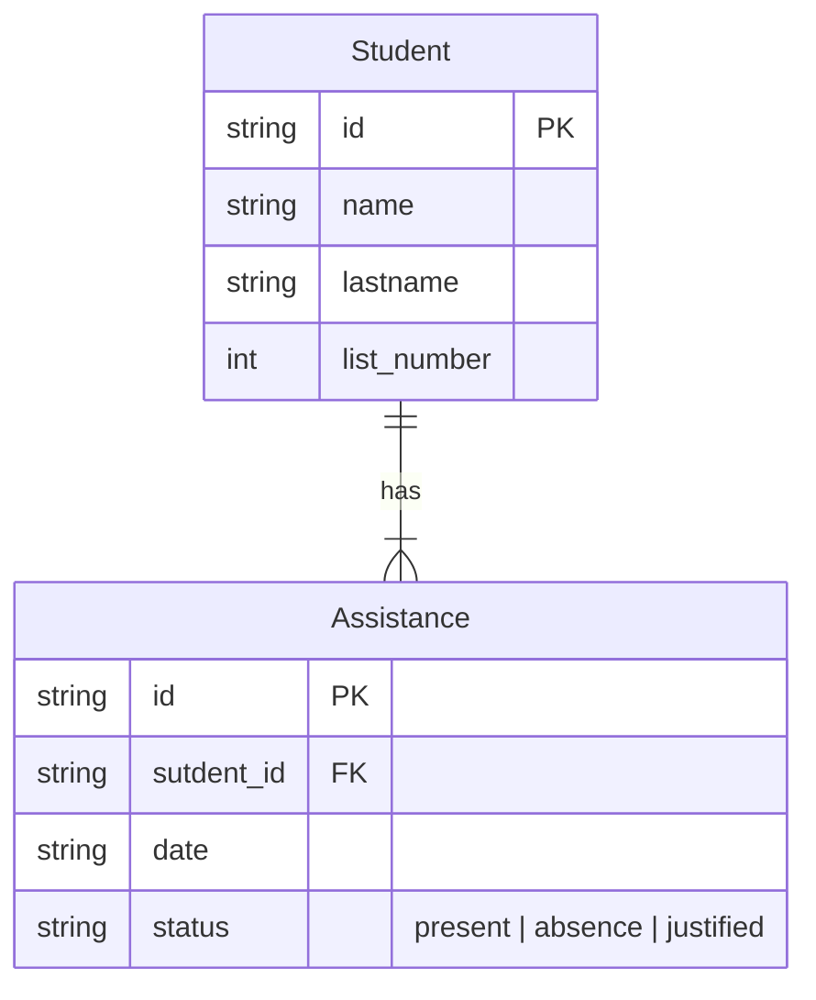

```mermaid
erDiagram
    Student {
        string id PK
        string name
        string lastname
        int list_number
     }

     Assistance {
        string id PK
        string sutdent_id FK
        string date
        string status "present | absence | justified"
     }

    Student ||--|{ Assistance: has
```