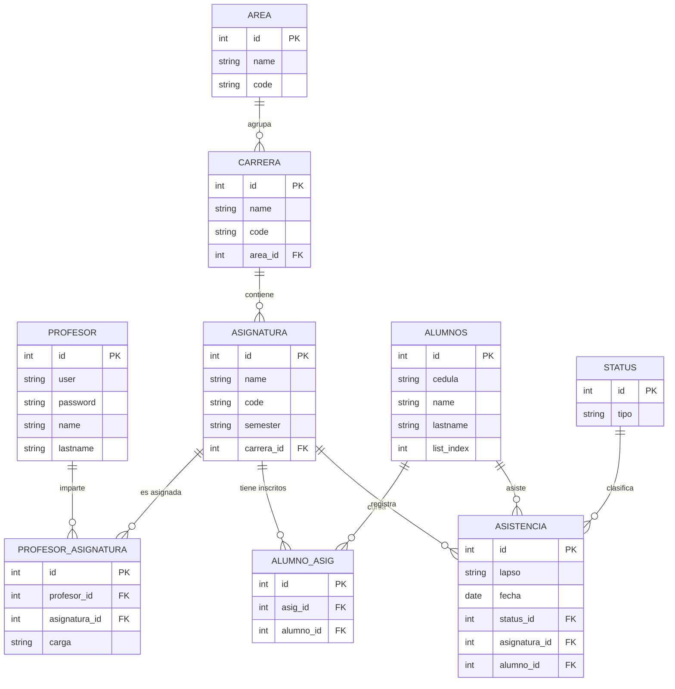

## Esquema de la base de datos

```mermaid
erDiagram
    PROFESOR ||--o{ PROFESOR_ASIGNATURA : "imparte"
    ASIGNATURA ||--o{ PROFESOR_ASIGNATURA : "es asignada"
    CARRERA ||--o{ ASIGNATURA : "contiene"
    AREA ||--o{ CARRERA : "agrupa"
    ASIGNATURA ||--o{ ALUMNO_ASIG : "tiene inscritos"
    ALUMNOS ||--o{ ALUMNO_ASIG : "cursa"
    STATUS ||--o{ ASISTENCIA : "clasifica"
    ASIGNATURA ||--o{ ASISTENCIA : "registra"
    ALUMNOS ||--o{ ASISTENCIA : "asiste"

    PROFESOR {
        int id PK
        string user
        string password
        string name
        string lastname
    }

    PROFESOR_ASIGNATURA {
        int id PK
        int profesor_id FK
        int asignatura_id FK
        string carga
    }

    ASIGNATURA {
        int id PK
        string name
        string code
        string semester
        int carrera_id FK
    }

    CARRERA {
        int id PK
        string name
        string code
        int area_id FK
    }

    AREA {
        int id PK
        string name
        string code
    }

    ALUMNO_ASIG {
        int id PK
        int asig_id FK
        int alumno_id FK
    }

    ALUMNOS {
        int id PK
        string cedula
        string name
        string lastname
        int list_index
    }

    ASISTENCIA {
        int id PK
        string lapso
        date fecha
        int status_id FK
        int asignatura_id FK
        int alumno_id FK
    }

    STATUS {
        int id PK
        string tipo
    }
```
